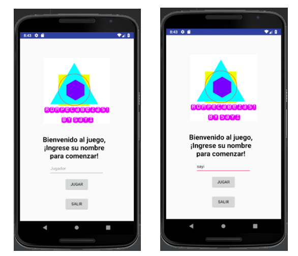
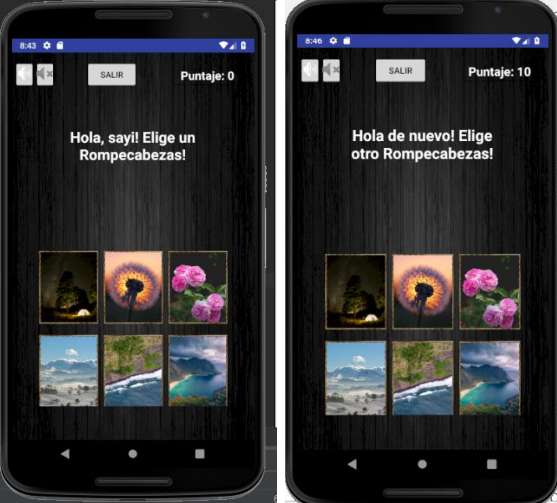
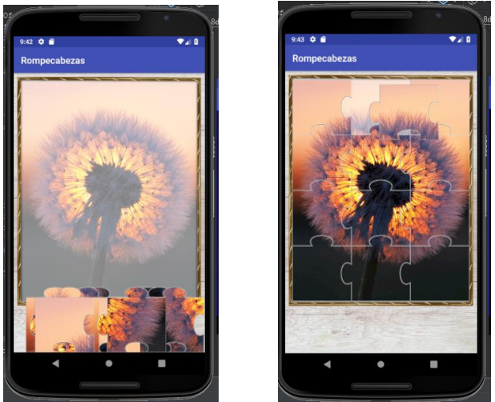

# ROMPECABEZAS.APP

Descripción
===========
### El objetivo de este trabajo es entender e implementar técnicas básicas de Android. Para esto se desarrolló una aplicación del juego de rompecabezas, la misma puede ser corrida sobre el sistema operativo Android y el entorno de desarrollo utilizado es Android Studio versión 3.1.3
###El juego de rompecabezas consiste del armado de una imagen por medio de sus piezas constituyentes.
**NAVEGABILIDAD**
**ActivityMain -> ElegirPuzzle -> PuzzleActivity**

### Esta realizado con **Android Studio3.1.3**. 

#### Se dejan imagenes ilustrativas del proyecto.

